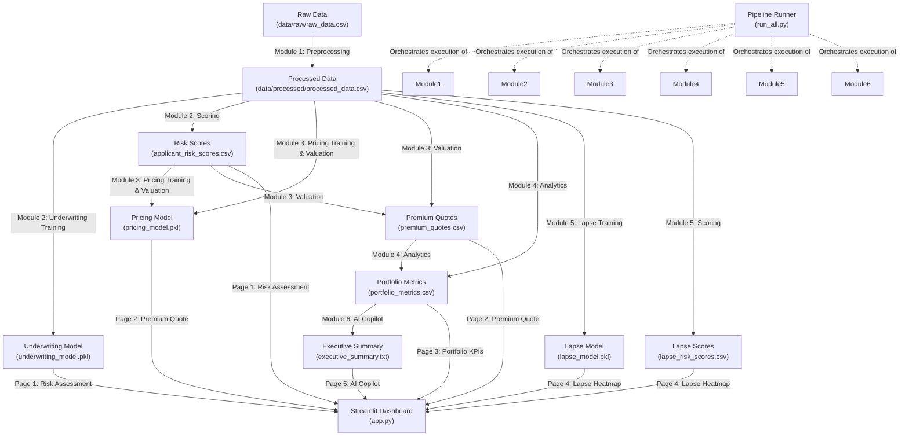

# Healthcare Actuarial Intelligence Platform (AI-AIP) Repository Analysis

This report summarizes the analysis of the Healthcare Actuarial Intelligence Platform (AI-AIP) repository based on the core specifications: [feature_dict.md](file:///c:/Users/User/Desktop/AI%20AIP/AIAIP_project/Healthcare-Analytics-Agent/reports/feature_dict.md), [data_quality_report.md](file:///c:/Users/User/Desktop/AI%20AIP/AIAIP_project/Healthcare-Analytics-Agent/reports/data_quality_report.md), and [AI_AIP_Implementation_Plan.pdf](file:///C:/Users/User/Desktop/AI%20AIP/AIAIP_project/Healthcare-Analytics-Agent/AI_AIP_Implementation_Plan.pdf).

---

## 1. Project Goals

The primary goal of the AI-Powered Health Insurance Actuarial Intelligence Platform (AI-AIP) is to consolidate the fragmented systems of health insurance (underwriting, pricing, portfolio monitoring, and retention) into a unified, AI-powered decision-support system.

Key objectives include:
*   **Actuarial Risk Assessment**: Assess applicant risk using Machine Learning (ML) underwriting models that output numerical risk scores and group applicants into Risk Classes (Low, Medium, High, Very High).
*   **Claim Cost Prediction**: Use XGBoost regression to predict individual expected claim costs (`claim_cost`).
*   **Actuarial Pricing Recommendation**: Recommend actuarially fair premiums by adjusting predicted claim costs with configurable safety loading factors based on the applicant's risk band.
*   **Lapse Prediction**: Build an XGBoost classification model to predict the probability of policyholder lapse/churn and map them to retention strategies (At-Risk, Watch, Stable).
*   **Portfolio Analytics**: Calculate and monitor key portfolio performance indicators (Claim Frequency, Average Severity, Loss Ratio, and trends) across demographic groups, regions, and policy types.
*   **AI Copilot Integration**: Employ a Large Language Model (Claude/OpenAI) to generate executive commentary and allow natural language querying over portfolio metrics.
*   **Unified Dashboard**: Serve all functions through a multi-page interactive Streamlit dashboard.

---

## 2. Modules

The platform is organized into the following distinct functional modules:

### Module 1: Data Ingestion & Preprocessing
*   **Function**: Ingest the raw data, perform data quality checks, impute missing values, and handle duplicates.
*   **Preprocessing Rules**:
    *   *Categorical Imputation*: Impute missing geographic categoricals (`C_H`, `C_C`) as `"Unknown"`.
    *   *Numerical Imputation*: Impute missing geographic indexes (`IICIMUN`, `IICIPROV`, `C_GI`, `C_II`, `C_IE_P`, `C_IE_S`, `C_IE_T`, `C_GE_P`, `C_GE_S`, `C_GE_T`) using median values.
    *   *Lapse Target*: Transform `lapse` code into `lapse_binary` (0 = Active, 1 = Lapsed). Status code `2` maps to 0; codes `1` (Early Lapse) and `3` (Lapse at Expiry) map to 1.
*   **Output**: Cleaned and validated dataset (`data/processed/processed_data.csv`).

### Module 2: Feature Engineering & Underwriting Risk Engine
*   **Feature Engineering**: Derived features are constructed from raw variables:
    *   `insured_duration` = `period - year_effect_insured`
    *   `policy_duration` = `period - year_effect_policy`
    *   `family_size` = Group size count of policyholders sharing `ID_policy` in the calendar year.
    *   `claim_frequency` = `n_medical_services / exposure_time`
    *   `claim_severity` = `cost_claims_year / n_medical_services` (handling division by zero for no services)
    *   `loss_ratio` = `cost_claims_year / premium`
    *   `premium_per_exposure` = `premium / exposure_time`
    *   `claims_per_exposure` = `cost_claims_year / exposure_time`
    *   `age_band` = Categorized into `18-25`, `26-35`, `36-50`, `51-65`, `65+`
    *   `seniority_band` = Categorized into `0-2`, `3-5`, `6-10`, `10+` (based on seniority variables)
    *   `insured_lapsed_flag` / `policy_lapsed_flag` = Boolean indicators derived from lapse dates.
*   **Underwriting Risk Score Construction**:
    *   Compute a composite `risk_score` (0–100) based on weighted metrics: **50% Loss Ratio**, **30% Claim Frequency**, and **20% Age**.
    *   Segment applicants into `risk_class` (Low, Medium, High, Very High) using quartile bounds of the risk score.
*   **Model**: XGBoostClassifier trained to predict `risk_class` (encoded: 0, 1, 2, 3) using predictors like age, BMI (if applicable), condition severity, and claims history. Explainability is implemented via SHAP.
*   **Output**: Underwriting model (`models/underwriting/underwriting_model.pkl`) and scoring results (`outputs/underwriting/applicant_risk_scores.csv`).

### Module 3: Claim Cost & Pricing Engine
*   **Function**: Predict expected claim cost and calculate recommended premiums.
*   **Model**: XGBoostRegressor trained on `cost_claims_year` using predictors like risk score, age, gender, and policy type.
*   **Pricing Logic**: Recommended Premium = Predicted Claim Cost × Loading Factor.
    *   *Loading Factors*: `Low = 1.15`, `Medium = 1.25`, `High = 1.45`, `Very High = 1.65`.
    *   *Hard Constraint*: recommended premium must be $\ge$ $\lfloor\text{Predicted Cost} \times 1.10\rfloor$ for safety margin.
*   **Output**: Pricing model (`models/pricing/pricing_model.pkl`), expected costs (`outputs/pricing/predicted_claim_cost.csv`), and premium quotes (`outputs/pricing/premium_quotes.csv`).

### Module 4: Portfolio Analytics Engine
*   **Function**: Summarize risk metrics, claim counts, and financial performance across the portfolio.
*   **Metrics**: Calculate aggregated frequency, severity, loss ratio, and trend indicators grouped by region, age group, and policy type.
*   **Output**: Aggregated metric tables (`outputs/portfolio/portfolio_metrics.csv`).

### Module 5: Lapse Prediction Engine
*   **Function**: Predict likelihood of policy/insured churn.
*   **Model**: XGBoostClassifier (binary classification) optimized with `scale_pos_weight` to address class imbalance.
*   **Retention Logic**: Group lapse probability into:
    *   *At-Risk* (prob > 0.70) $\rightarrow$ Action: agent call + discount offer
    *   *Watch* (0.40 - 0.70) $\rightarrow$ Action: loyalty email
    *   *Stable* (< 0.40) $\rightarrow$ Action: no action
*   **Output**: Lapse model (`models/lapse/lapse_model.pkl`) and lapse scoring output (`outputs/lapse/lapse_risk_scores.csv`).

### Module 6: AI Copilot & Streamlit Dashboard
*   **Streamlit App**: Interactive front-end containing 5 pages:
    1.  *Risk Assessment*: Live form inputs calculating applicant risk score, risk class gauge, and SHAP waterfall chart.
    2.  *Premium Quote*: Interactive loading factors sliders and premium calculations.
    3.  *Portfolio KPIs*: Dynamic visualizations for portfolio frequency, severity, loss ratio, and alert thresholds.
    4.  *Lapse Heatmap*: Heatmap visualization of lapse risk by cohort, action tables, and CSV exporter.
    5.  *AI Copilot*: Natural language text interface querying portfolio metrics and displaying streaming responses.
*   **AI Copilot**: Integrates Claude API to parse `portfolio_metrics.csv` and auto-generate executive briefings.
*   **Output**: Main dashboard files (`dashboard/app.py`, `dashboard/pages/*.py`) and AI text summary (`outputs/executive_summary.txt`).

---

## 3. Dependencies Between Modules

The workflow follows a strict sequential dependency pipeline, where downstream predictive and analytical models rely on processed datasets, model scores, or aggregated metrics from upstream stages.



### Dependency Breakdown:
1.  **Data Dependency**: All subsequent modules require `processed_data.csv` generated by Module 1.
2.  **Risk Score Dependency**: Module 3 (Pricing) requires `risk_score` and `risk_class` generated during the underwriting phase (Module 2) to assign proper premium loading factors (1.15x - 1.65x).
3.  **Financial Dependency**: Module 4 (Portfolio Analytics) requires the calculated premium quotes from Module 3 to compute financial KPIs like `loss_ratio` (Claims/Premiums).
4.  **Reporting Dependency**: Module 6 (AI Copilot page) requires the aggregated `portfolio_metrics.csv` to format the structured input prompt sent to the Claude API.
5.  **Integration Dependency**: `run_all.py` coordinates the complete process sequentially to prevent running scripts out of order.

---

## 4. Folder Structure Required

The project layout has been pre-configured in the repository as follows:

```
├── .env.example                            # API credentials template
├── .gitignore                              # Git exclusions
├── Healthcare-Analytics-Agent.code-workspace
├── README.md                               # Empty, needs setup & execution guide
├── pyproject.toml                          # Package configuration and dependencies
├── uv.lock                                 # Package lockfile
├── run_all.py                              # Core pipeline runner (currently empty)
├── data/
│   ├── raw/
│   │   └── raw_data.csv                    # Ingested dataset (36MB, 228k rows)
│   └── processed/
│       └── processed_data.csv              # Processed dataset (40MB, 228k rows)
├── models/
│   ├── underwriting/
│   │   └── underwriting_model.pkl          # Saved Underwriting XGBoost model (empty)
│   ├── pricing/
│   │   └── pricing_model.pkl               # Saved Pricing XGBoost model (empty)
│   └── lapse/
│       └── lapse_model.pkl                 # Saved Lapse XGBoost model (empty)
├── notebooks/
│   ├── 01_eda.ipynb                        # EDA template
│   ├── 02_feature_engineering.ipynb        # Feature Engineering template
│   ├── 03_underwriting.ipynb               # Underwriting modeling template
│   ├── 04_pricing.ipynb                    # Pricing modeling template
│   ├── 05_portfolio.ipynb                  # Portfolio analytics template
│   └── 06_lapse.ipynb                      # Lapse modeling template
├── outputs/
│   ├── executive_summary.txt               # Copilot executive summary output
│   ├── underwriting/
│   │   └── applicant_risk_scores.csv       # Scored underwriting details
│   ├── pricing/
│   │   ├── predicted_claim_cost.csv        # Estimated claim costs
│   │   └── premium_quotes.csv              # Recommended premiums
│   ├── portfolio/
│   │   └── portfolio_metrics.csv           # Summarized KPI aggregates
│   └── lapse/
│       └── lapse_risk_scores.csv           # Scored lapse indicators
├── reports/
│   ├── feature_dict.md                     # Feature Dictionary (v1.0)
│   ├── data_quality_report.md              # Data Quality Analysis and Preprocessing guidelines
│   └── validation_report.md                # System verification report template
├── src/                                    # Package source directory
│   ├── agent/                              # Agent framework stubs
│   ├── copilot/                            # Claude API prompts and summary generation scripts
│   ├── data/                               # Data cleaning and ingestion scripts
│   ├── lapse/                              # Churn modeling scripts (train/predict/retention)
│   ├── portfolio/                          # Aggregations and Plotly visual scripts
│   ├── prediction/                         # General helper wrappers
│   ├── pricing/                            # Regressor training and quoting scripts
│   ├── underwriting/                       # Classifier training, scoring, and SHAP explainability
│   └── utils/                              # Configurations, helpers, and custom logger
└── dashboard/                              # Streamlit dashboard files
    ├── app.py                              # Streamlit entrypoint
    ├── components/                         # Shared UI blocks
    └── pages/                              # Subpages (Risk, Pricing, Portfolio, Lapse, Copilot)
```

---

## 5. Recommended Implementation Order

To ensure clean development and minimize integration failures, we recommend developing the modules in their logical order of execution.

| Phase | Days | Module / Task | Description & Deliverables | Upstream Dependencies |
| :--- | :---: | :--- | :--- | :--- |
| **Phase 1** | **Day 1** | **M1: Data Quality & Cleaning** | Implement `src/data/clean.py`, `ingest.py`, and `preprocess.py` to impute nulls and create the lapse target. Deliver `data/processed/processed_data.csv`. | None |
| **Phase 2** | **Day 2** | **M1/M2: Feature Engineering** | Derive exposure, claims, and household metrics (e.g. `loss_ratio`, `claim_frequency`, `family_size`). Draft Jupyter EDA (`notebooks/01_eda.ipynb`) and feature engineering files (`notebooks/02_feature_engineering.ipynb`). | Phase 1 |
| **Phase 3** | **Day 3** | **M2: Underwriting Risk Engine** | Train XGBoost risk classifier (`src/underwriting/train.py`, `predict.py`). Implement SHAP explainability (`explain.py`). Deliver `applicant_risk_scores.csv` and `underwriting_model.pkl`. | Phase 2 |
| **Phase 4** | **Day 4** | **M3 & M5: Modeling Core** | Train pricing XGBoost regressor (`src/pricing/train.py`, `predict.py`, `premium.py`) and lapse binary classifier (`src/lapse/train.py`, `predict.py`, `retention.py`). Deliver pricing/lapse `.pkl` models, `predicted_claim_cost.csv`, `premium_quotes.csv`, and `lapse_risk_scores.csv`. | Phase 3 |
| **Phase 5** | **Day 5** | **M4: Portfolio Analytics** | Compute aggregated region/demographic portfolio indicators (`src/portfolio/metrics.py` and `visualizations.py`). Save to `outputs/portfolio/portfolio_metrics.csv`. Build validation scripts (`reports/validation_report.md`). | Phase 4 |
| **Phase 6** | **Day 6** | **M6: Dashboard & Copilot** | Implement dashboard components (`dashboard/pages/*.py`, `dashboard/app.py`). Setup Claude API connection in `src/copilot/` to read portfolio data and write to `outputs/executive_summary.txt`. | Phase 5 |
| **Phase 7** | **Day 7** | **Integration & Runner** | Build and test command-line interface pipeline (`run_all.py` supporting `train`, `predict`, and `dashboard` modes). Finalize documentation and usage instructions in `README.md`. | Phase 6 |
